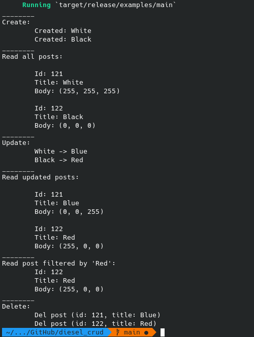

## Diesel CRUD

Testing CRUD with an ORM and Query Builder for Rust

https://github.com/ali55on/diesel_crud

Function signatures:
```rust
// Create
pub fn create_the_draft(title: &str, body: &str) -> Post;
pub fn create_post_publication(post: &Post);
// Read
pub fn read_posts(pattern: Option<&str>) -> Vec<Post>;
// Update
pub fn update_post(post: &Post, new_title: &str, new_body: &str);
// Delete
pub fn delete_post(post: &Post);

```
Simple test:


